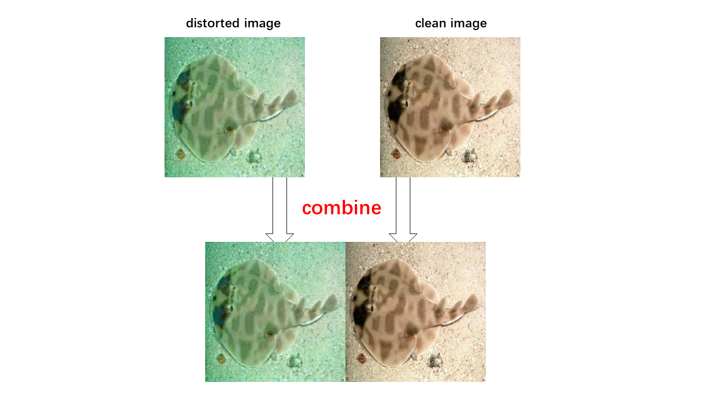

## Dependencies
* [Python 3.6](https://www.continuum.io/downloads)
* [PyTorch 0.4.0](http://pytorch.org/)
* [TensorFlow 1.5+](https://www.tensorflow.org/) (optional for tensorboard)


## Datasets 
### 1. Downloading the dataset
To download the training dataset from [here](http://irvlab.cs.umn.edu/enhancing-underwater-imagery-using-generative-adversarial-networks)


### 2. preparing the training data
To combine paired images.Here is an example:
<p align="center"></p>

```bash
python preprocess.py  --input_left original_data/dataA  \
                      --input_right original_data/dataB \
                      --output_dir training_data/data

```

## Training
```bash
python main.py  --mode train  --batch_size 8  --data_dir training_data

```

## Testing
```bash
python main.py  --mode test  --data_dir testing_data  --test_epoch 50
```


