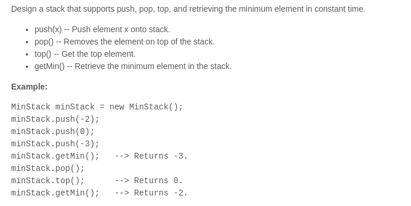

### 问题描述
***

### python实现
***
```python
class MinStack(object):

    def __init__(self):
        """
        initialize your data structure here.
        """
        self.data = list()
        

    def push(self, x):
        """
        :type x: int
        :rtype: void
        """
        if not self.data:
            self.data.append((x, x))
        else:
            self.data.append((x, min(x, self.data[-1][-1])))
        

    def pop(self):
        """
        :rtype: void
        """
        self.data.remove(self.data[-1])
        

    def top(self):
        """
        :rtype: int
        """
        if self.data: return self.data[-1][0]
        else:return 0
        

    def getMin(self):
        """
        :rtype: int
        """
        if self.data: return self.data[-1][-1]
        else :return 0
        


# Your MinStack object will be instantiated and called as such:
# obj = MinStack()
# obj.push(x)
# obj.pop()
# param_3 = obj.top()
# param_4 = obj.getMin()
```
### 总结：
***
1. 面向对象